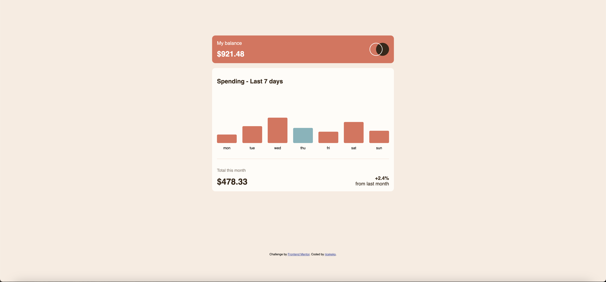

# Frontend Mentor - Expenses chart component solution

This is a solution to the [Expenses chart component challenge on Frontend Mentor](https://www.frontendmentor.io/challenges/expenses-chart-component-e7yJBUdjwt). Frontend Mentor challenges help you improve your coding skills by building realistic projects. 

## Table of contents

- [Overview](#overview)
  - [The challenge](#the-challenge)
  - [Screenshot](#screenshot)
- [My process](#my-process)
  - [Built with](#built-with)
  - [What I learned](#what-i-learned)
  - [Continued development](#continued-development)
  - [Useful resources](#useful-resources)
- [Author](#author)
- [Acknowledgments](#acknowledgments)

## Overview

### The challenge

Users should be able to:

- View the bar chart and hover over the individual bars to see the correct amounts for each day
- See the current day’s bar highlighted in a different colour to the other bars
- View the optimal layout for the content depending on their device’s screen size
- See hover states for all interactive elements on the page
- **Bonus**: Use the JSON data file provided to dynamically size the bars on the chart

### Screenshot

### Links

- Solution URL: (https://github.com/ricekeks/expenses-chart)
- Live Site URL: (https://ricekeks.github.io/expenses-chart/)

## My process

### Built with

- Semantic HTML5 markup
- CSS custom properties
- Flexbox
- Mobile-first workflow
- Javascript

## What I learned

What I need to learn is to pay closer attention to the designs including the active states. Otherwise I am getting continuesly surprised by elements I did not consider during the sketch phase. That makes late additions like for example the tooltips in this specific case rather difficult and nerve wrecking.

Other than that I am very happy how this project went rather smoothly from start to finish and I can feel the improvements I have made up until now. Especially with flexbox I feel confident and usually secure in what to do to archieve expected results. With Javascript it is similar but slower, since I've just started using and understanding it.

I hope this solution helps someone who is looking to learn HTML, CSS and JS as well. I tried to make it understandable for others and myself.

### Useful resources

- DOM Manipulation by procademy: (https://www.youtube.com/watch?v=xR6d7CkXlPs)
- Tooltips by w3schools: (https://www.w3schools.com/howto/howto_css_tooltip.asp)

## Author

- Frontend Mentor - [@ricekeks](https://www.frontendmentor.io/profile/ricekeks)

## Acknowledgements

- procademy: (https://www.youtube.com/@procademy)
- w3schools.com: (https://www.w3schools.com/)